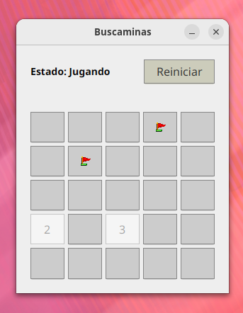

# 💣 Buscaminas JavaFX 💣

¡Bienvenido al repositorio de **Buscaminas JavaFX**! Esta es una recreación del clásico juego de lógica implementada en **Java** utilizando **JavaFX** para la interfaz gráfica de usuario (GUI). 



El proyecto destaca por sincronizar de forma eficiente una arquitectura visual con matrices lógicas de estado, aplicando algoritmos recursivos clásicos del desarrollo de videojuegos.

---

## ⚠️ Requisito Importante: Librería JavaFX
Para reducir el tamaño del repositorio y cumplir con las políticas de almacenamiento de GitHub, **este proyecto no incluye los archivos binarios de JavaFX**.

Para ejecutar el juego, debes:
1. Descargar el [JavaFX SDK](https://gluonhq.com/products/javafx/) (versión 17.0.14 recomendada).
2. Colocar los archivos de la librería en la carpeta: `lib/javafx-sdk-17.0.14/`.
3. Asegurarte de que tu IDE o entorno de compilación (como IntelliJ o Eclipse) apunte a esta carpeta en la configuración del *Build Path* o *Module Path*.

---

##  Características Principales

* **Interfaz Gráfica Modular:** Diseñada mediante jerarquías de contenedores (`VBox`, `HBox` y `GridPane`).
* **Separación de Estilos con CSS:** Todo el apartado visual se gestiona de forma desacoplada mediante hojas de estilo.
* **Algoritmo de Expansión Recursiva:** Apertura automatizada de zonas vacías colindantes.
* **Control Total del Estado:** Gestión completa de eventos de ratón para clics izquierdo y derecho.
* **Persistencia y Reinicio Limpio:** Sistema robusto de reseteo de estructuras lógicas.

---

##  Arquitectura Técnica y Estructura

### 1. Interfaz de Usuario (Layout)
La ventana principal se organiza mediante la siguiente jerarquía de nodos de JavaFX:

```text
VBox (Contenedor Raíz)
├── HBox (Panel Superior de Control)
│   ├── Label (lblInfo)         → Muestra el estado actual: "Jugando", "¡Victoria!" o "Derrota"
│   └── Button (btnReiniciar)   → Restablece por completo la partida
└── GridPane (Tablero Lógico)    → Matriz de 5x5 botones interactivos